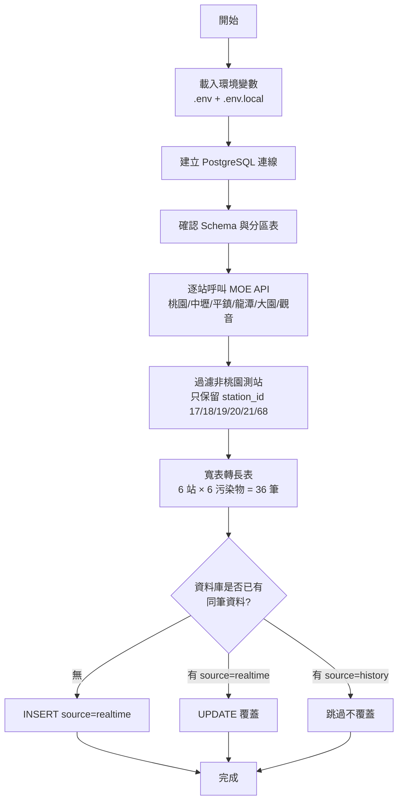
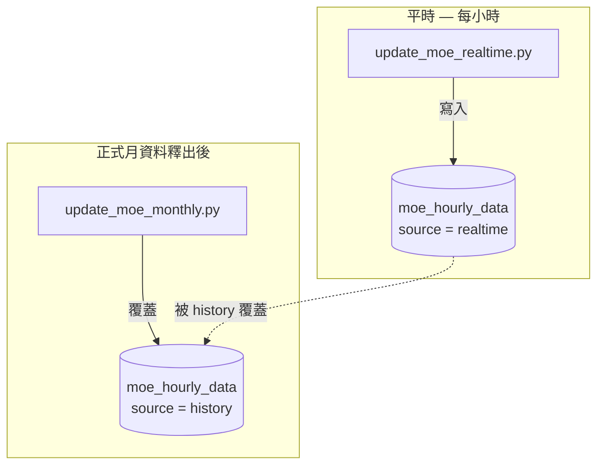
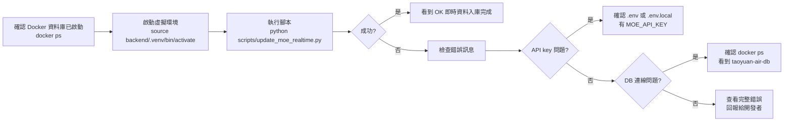

# MOE 即時資料入庫設計文件

## 目的

本文件說明環境部（MOE）空氣品質即時資料匯入資料庫的設計。

目前前端已可透過 MOE API 顯示即時資料，但資料只停留在前端 API route 回傳結果，尚未寫入 `moe_hourly_data`。本功能新增一支即時入庫腳本，讓 MOE 即時 API 資料可定期寫入 PostgreSQL，補齊近 24 小時與後續歷史補正前的資料缺口。

## 實作範圍

新增腳本：

```text
scripts/update_moe_realtime.py
```

更新文件：

```text
README.md
database/README.md
database/MOE_REALTIME_IMPORT_DESIGN.md
```

本次只處理 MOE 即時資料入庫，不包含 CWA、TYDEP、NAQO 或其他資料源。

## 資料流



```text
MOE aqx_p_432 即時 API
  -> 抓取桃園市 6 個環境部測站
  -> 過濾非目標 station_id
  -> 解析 API records
  -> 轉成 moe_hourly_data 長表格式
  -> 寫入 PostgreSQL
  -> source = 'realtime'
```

目標測站：

| 測站名稱 | station_id |
| --- | --- |
| 桃園 | `17` |
| 大園 | `18` |
| 觀音 | `19` |
| 平鎮 | `20` |
| 龍潭 | `21` |
| 中壢 | `68` |

## 使用 API

API：

```text
https://data.moenv.gov.tw/api/v2/aqx_p_432
```

查詢方式：

```text
format=json
offset=0
limit=10
api_key=<MOE_API_KEY>
filters=SiteName,EQ,<測站名稱>
```

注意：MOE API 的 `filters=SiteName,EQ,...` 中逗號不能被轉成 `%2C`，因此腳本以手動字串方式附加 filters。

## 環境變數

需要資料庫密碼：

```env
POSTGRES_PASSWORD=
```

需要 MOE API key，腳本會依序讀取：

```env
MOE_API_KEY=
NEXT_PUBLIC_MOE_API_KEY=
```

讀取順序：

1. 專案根目錄 `.env`
2. `frontend-web/.env.local`

因此若目前前端已可使用 `NEXT_PUBLIC_MOE_API_KEY`，腳本也可直接讀取同一組 key。

## 資料表

寫入目標：

```text
moe_hourly_data
```

此表為月分區表，分區鍵為：

```text
monitor_date
```

腳本會沿用 `scripts/import_moe_stations.py` 內的：

```python
ensure_moe_partitions(...)
```

在匯入前自動確認對應月份分區存在。

## 欄位對應

MOE API 回傳為單站寬表格式，腳本會轉為 `moe_hourly_data` 長表格式。

| API 欄位 | DB 欄位 | 說明 |
| --- | --- | --- |
| `siteid` | `station_id` | MOE 測站 ID |
| `sitename` | - | 測站名稱，作為備援 mapping |
| `publishtime` | `monitor_date` | 資料發布時間 |
| `so2` | `concentration`, `concentration_numeric` | SO2 |
| `co` | `concentration`, `concentration_numeric` | CO |
| `o3` | `concentration`, `concentration_numeric` | O3 |
| `no2` | `concentration`, `concentration_numeric` | NO2 |
| `pm10` | `concentration`, `concentration_numeric` | PM10 |
| `pm2.5` | `concentration`, `concentration_numeric` | PM2.5 |

污染物對應：

| API 欄位 | pollutant_id | pollutant_name | pollutant_eng_name | unit |
| --- | --- | --- | --- | --- |
| `so2` | `1` | 二氧化硫 | `SO2` | `ppb` |
| `co` | `2` | 一氧化碳 | `CO` | `ppm` |
| `o3` | `3` | 臭氧 | `O3` | `ppb` |
| `no2` | `7` | 二氧化氮 | `NO2` | `ppb` |
| `pm10` | `4` | 懸浮微粒 | `PM10` | `ug/m3` |
| `pm2.5` | `33` | 細懸浮微粒 | `PM2.5` | `ug/m3` |

## 時間處理

MOE 即時 API 的 `publishtime` 目前格式為：

```text
YYYY/MM/DD HH:mm:ss
```

腳本支援以下格式：

```text
YYYY/MM/DD HH:mm:ss
YYYY/MM/DD HH:mm
YYYY-MM-DD HH:mm:ss
YYYY-MM-DD HH:mm
```

入庫時間欄位：

| DB 欄位 | 值 |
| --- | --- |
| `monitor_date` | `publishtime` |
| `period_start` | `publishtime` |
| `period_end` | `publishtime + 59 分鐘` |

此設計沿用既有 MOE 歷史匯入腳本的時間區間設定。

## 資料品質

濃度解析沿用既有函式：

```python
parse_concentration(...)
```

判斷規則：

| 狀況 | concentration_numeric | data_quality |
| --- | --- | --- |
| 可轉成數值 | 數值 | `good` |
| 空值、`x`、無法轉數值 | `NULL` | `invalid` |

## 寫入規則

寫入時固定：

```text
source = 'realtime'
```

唯一鍵沿用 `moe_hourly_data`：

```text
(station_id, monitor_date, pollutant_id)
```

衝突處理：

```sql
ON CONFLICT (station_id, monitor_date, pollutant_id)
DO UPDATE ...
WHERE moe_hourly_data.source = 'realtime'
```

也就是：

| 既有資料狀態 | 行為 |
| --- | --- |
| 無資料 | 新增 realtime |
| 已有 `source = 'realtime'` | 更新 realtime |
| 已有 `source = 'history'` | 不覆蓋 |

此規則確保即時資料不會覆蓋正式歷史資料。

## 與月資料補正流程的關係



既有月資料補正腳本：

```text
scripts/update_moe_monthly.py
```

負責在每月正式歷史資料釋出後，將正式資料寫入 `moe_hourly_data`，並覆蓋同時間的 realtime 資料。

因此整體策略為：

```text
平時：
  update_moe_realtime.py
  -> 寫入 source = realtime

正式月資料釋出後：
  update_moe_monthly.py
  -> history 覆蓋 realtime
```

## 執行方式

### 操作流程



### 手動執行

```bash
cd ~/taoyuan-air
source backend/.venv/bin/activate
python scripts/update_moe_realtime.py
```

成功時會看到類似：

```text
MOE 即時資料入庫工具
[INFO] 抓取 桃園 即時資料
...
[OK] 即時資料入庫完成：36 筆（有效 36，無效 0）
```

目前每次執行預期資料量：

```text
6 個測站 × 6 個污染物 = 36 筆
```

## 驗證方式

確認 realtime 筆數與時間：

```sql
SELECT
    COUNT(*) AS realtime_rows,
    COUNT(DISTINCT station_id) AS stations,
    MIN(monitor_date) AS min_time,
    MAX(monitor_date) AS max_time
FROM moe_hourly_data
WHERE source = 'realtime';
```

確認最近入庫資料：

```sql
SELECT
    s.station_name,
    h.monitor_date,
    h.pollutant_eng_name,
    h.concentration_numeric,
    h.unit,
    h.data_quality,
    h.source
FROM moe_hourly_data h
JOIN moe_stations s ON s.station_id = h.station_id
WHERE h.source = 'realtime'
ORDER BY h.monitor_date DESC, s.station_id, h.pollutant_eng_name
LIMIT 50;
```

## 後續排程建議

目前腳本可手動執行。若要自動化，可選擇：

1. 本機 crontab
2. Windows 工作排程器
3. 伺服器 cron
4. GitHub Actions

建議頻率：

```text
每小時執行一次
```

原因：

- MOE 空品資料本身為小時資料
- 目前資料庫設計為 `moe_hourly_data`
- 避免過度呼叫 API

## 注意事項

- 本功能只處理 MOE，不包含 CWA。
- MOE API 查詢「觀音」時可能混入非桃園的測站資料（例如 station_id=1），腳本已加入 `TARGET_STATION_IDS` 過濾，只處理 6 個目標站。
- 即時資料會增加資料庫筆數，但 MOE 每小時約 36 筆，一年約 315,360 筆，對 PostgreSQL 與目前月分區設計而言可控。
- 若未來 MOE API 欄位名稱改變，需要同步更新 `POLLUTANT_MAP` 與 `build_rows(...)`。
- 若前端要讀入庫後的近 24 小時資料，可改由 backend 查詢 `moe_hourly_data` 的 `source = 'realtime'` 或直接使用既有 `moe_latest_data` view。
